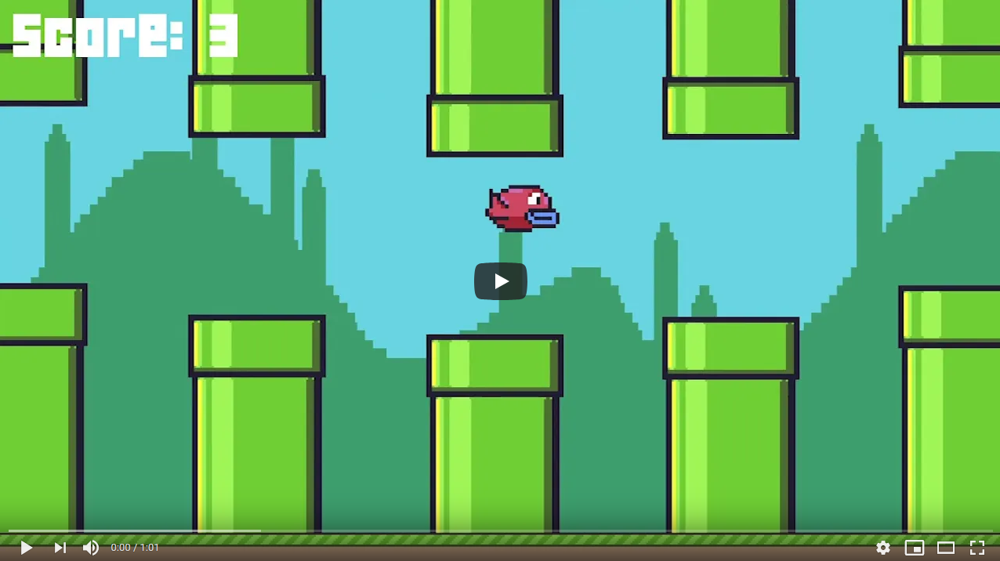

# Assignment 1 - Flappy Bird 🐤

- 💯**Worth**: 5%
- 📅**Due**: September 6, 2021 @ 23:59
- 🙅🏽‍**Penalty**: Late submissions lose 10% per day to a maximum of 3 days. Nothing is accepted after 3 days and a grade of 0% will be given.

## 🎯 Objectives

- Read and understand all of the Flappy Bird [notes](https://jac-cs-game-programming-f21.github.io/Notes/#/1-Flappy-Bird) and [source code](https://github.com/JAC-CS-Game-Programming-F21/1-Flappy-Bird) from Lecture 1.
- Influence the generation of pipes so as to bring about more complicated level generation.
- Give the player a medal for their performance, along with their score.
- Implement a pause feature, just in case life gets in the way of flying through pipes!
- Have the bird flap not only with the spacebar, but with mouse-clicks as well.

## 🎥 Demo

_You'll have to sign in with your JAC email._

## 🔍 Context

Your second assignment won't be quite as easy as last week's, but don't worry! The pieces, taken one at a time, are still quite bite-sized and manageable and will mainly be a recap of what we've covered thoroughly in lecture leading up to this point.

Be sure to review the [source code](https://github.com/JAC-CS-Game-Programming-F21/1-Flappy-Bird) from Lecture 1 so you have a firm understanding of how it works before diving in. In particular, take note of where the logic is for spawning pipes and the parameters that drive both the gap between pipes and the interval at which pipes spawn, as those will be two primary components of this update. You'll be making some changes to the `GameOverState`, so be sure to read through that as well and get a sense for how images are stored, since you'll be incorporating your own. Lastly, think about what you need in order to incorporate a pause feature (a simple version of which we saw in the lecture). And if we want to pause the music, we'll probably need a method to do this that belongs to the `Audio` object; try browsing the documentation on the [Mozilla Developer Network](https://developer.mozilla.org/en-US/docs/Web/API/HTMLAudioElement/Audio) to find out what it is!

1. 🔢 **Randomize** the:
   - gap between pipes (**vertical space**), such that they're no longer hardcoded to 75 pixels.
   - interval at which pairs of pipes spawn (**horizontal space**), such that they're not always 2 seconds apart.
2. 🥇 **Award the player a "medal"** when they enter the `GameOverState`, via an image displayed along with the score; this can be any image or any type of medal you choose (e.g., ribbons, actual medals, trophies, etc.), so long as each is different and based on the points they scored that life.
   - Choose 3 different medals, as well as the minimum score needed for each one.
   - To make it easy to test, have 0 points be no medal, and then 1/2/3 points be the 3 medals respectively.
3. ⏸ **Implement a pause feature**, such that the user can simply **press "P" and pause the state of the game**. This pause effect will be slightly fancier than the pause feature we showed in class, though not ultimately that much different.
   - When they pause the game, a simple sound effect should play (I recommend testing out bfxr for this, as seen in Lecture 0!).
   - At the same time this sound effect plays, the music should pause, and once the user presses P again, the gameplay and the music should resume just as they were.
   - Display a pause icon in the middle of the screen, nice and large, so as to make it clear the game is paused.
4. 🖱️ **Add mouse interactivity** to the game in order to more closely resemble the original Flappy Bird iOS game. The bird should **flap every time the mouse is clicked** in the canvas area.
   - This implementation will be very similar to how we're already capturing keyboard input, so I would probably start in `globals.js` to review how that's being done now.

## 🌿 Git

You can use either the Git CLI or you can also use VSC's built-in Git GUI client.

### 🖱️ GUI

1. In VSC, click on the third icon down in the left navigation bar to see a list of files that have changed and are ready to be staged.
2. Hover over where it says _Changes_ (right below the commit textbox) and click `+` to stage all the modified files to be committed. Alternatively, you can add specific files by clicking the `+` next to the individual file.
3. Type a commit message into the textbox and click the checkmark above it to commit all the files that were just staged.
4. Click `...` and then `push` to push the commit(s) up to GitHub.

### ⌨️ CLI

1. Run `git status` to see a list of files that have changed and are ready to be staged.
2. Run `git add .` to stage all the modified files to be committed. Alternatively, you can add specific files like this: `git add src/Bird.js`.
3. Run `git commit -m "A descriptive message here."` (including the quotes) to commit all the files that were just staged.
4. Run `git push` to push the commit(s) up to GitHub.

Regardless of the method you choose, it is very important that you commit frequently because:

- If you end up breaking your code, it is easy to revert back to a previous commit and start over.
- It provides a useful log of your work so that you (and your teammates if/when you're on a team) can keep track of the work that was done.

## 📥 Submission

Once you've made your final `git push` to GitHub, here's what you have to do to submit:

1. Go to [Gradescope](https://www.gradescope.ca/courses/4779) and click the link for this assignment.
2. Select the correct repository and branch from the dropdown menus.
3. Click _Upload_.
4. Record a screencast, **not to exceed 5 minutes in length**, in which you demonstrate your game's functionality.
   - The video should be recorded and uploaded using Microsoft Stream. [Please watch this instructional video on how to do so](https://web.microsoftstream.com/video/62738103-211f-4ddd-bb4a-c594eddcfb0a?list=studio) (you'll have to log in with your JAC email and password).
     - In the video I mention to toggle on the "share sound" option. I later realized that it might be hard to hear what you'll be saying if the game music is playing, so feel free to toggle off the "share sound" option if you find that it's hard to hear yourself over the music in the recording.
   - In your video's description, please timestamp where each of the following occurs in your gameplay demonstration:
     - Clear difference in horizontal and vertical gap between pipes.
     - Pausing the game.
     - Being awarded no medal, and being awarded the 3 tiers of medals.
     - Clicking the mouse to make the bird flap.
